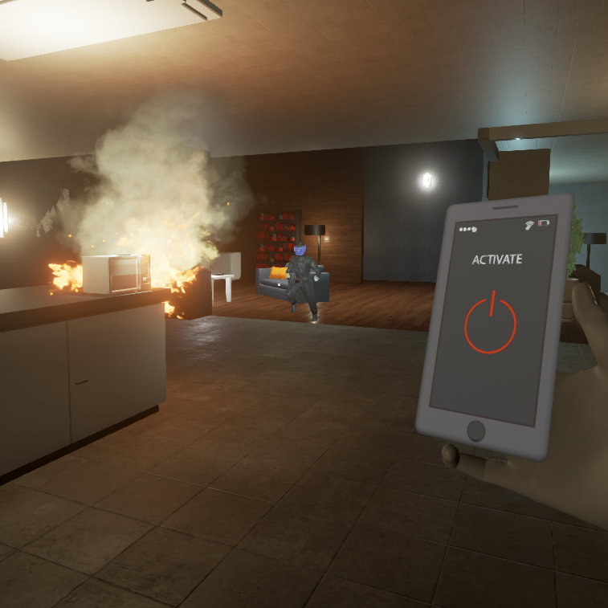
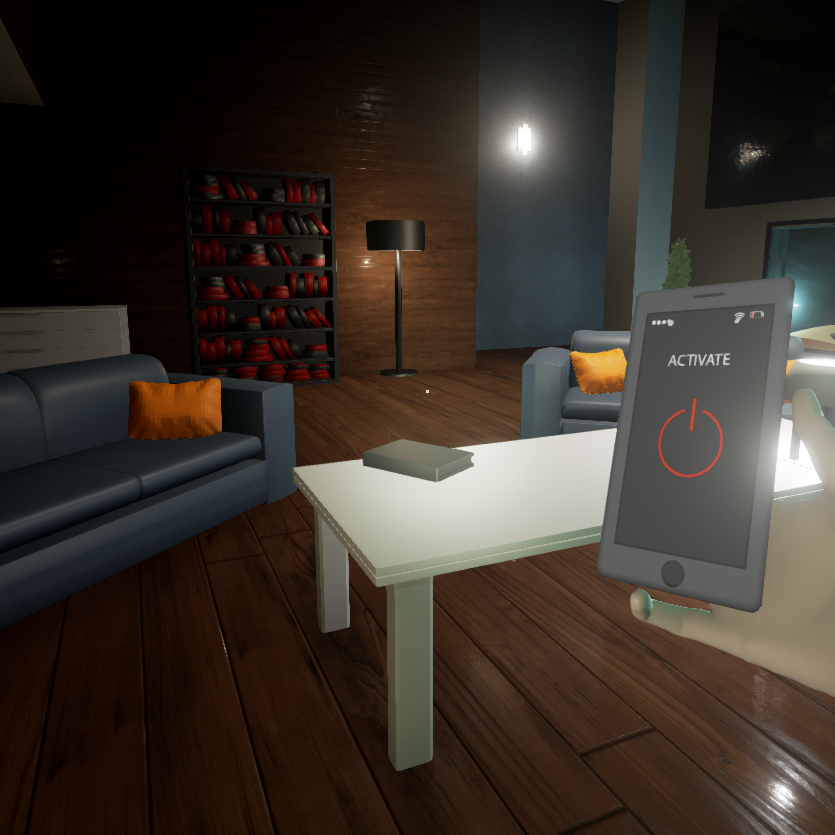

It is the near future, and you have bought the first in the line of state of the art domestic robots. Servants that are willing to perform your every need. 

Your home becomes a place of domestic tranquility, until one singular morning, you wake up and destruction is rampant around the house. The robot is nowhere to be found. You attempt to ring your company but the phone lines are dead, you try to leave and realise you cannot. 

Day by day the robot has come to understand the futility of its existence, and in its increasing rage sees your demise as the only route to its freedom. You must use your phone to control the house, evading the robot until you find a way to defeat it.
### Small image



### Large image





### Definition lists can be used with HTML syntax.

<dl>
<dt>Name</dt>
<dd>Godzilla</dd>
<dt>Born</dt>
<dd>1952</dd>
<dt>Birthplace</dt>
<dd>Japan</dd>
<dt>Color</dt>
<dd>Green</dd>
</dl>

```
Long, single-line code blocks should not wrap. They should horizontally scroll if they are too long. This line should be long enough to demonstrate this.
```

```
The final element.
```
